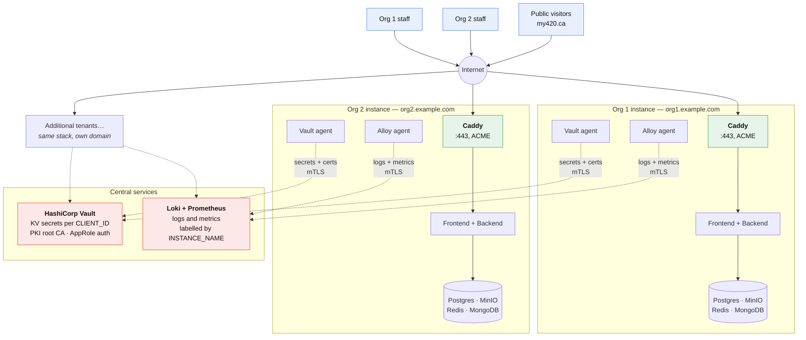
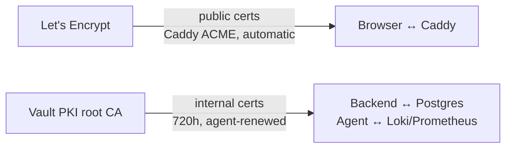
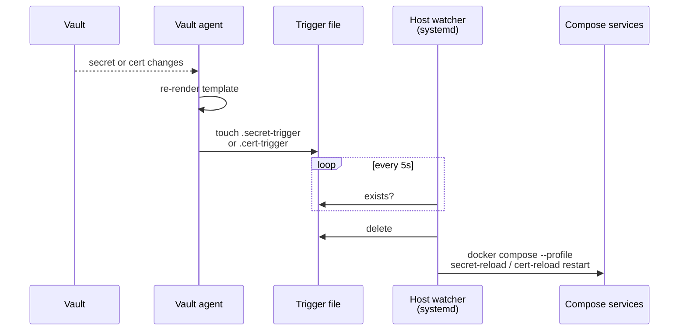
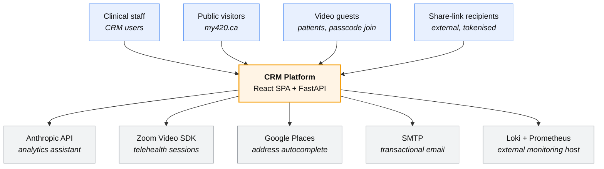
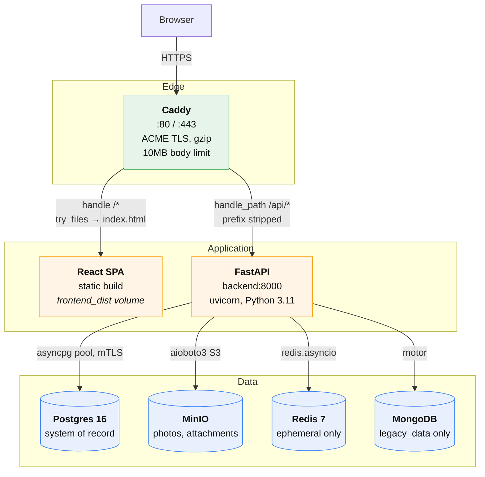
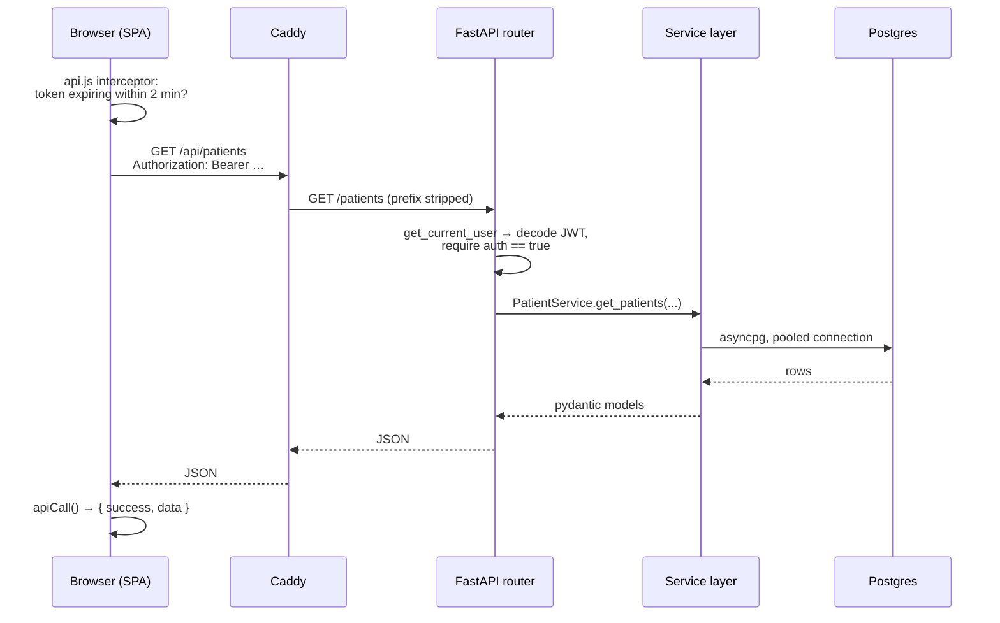
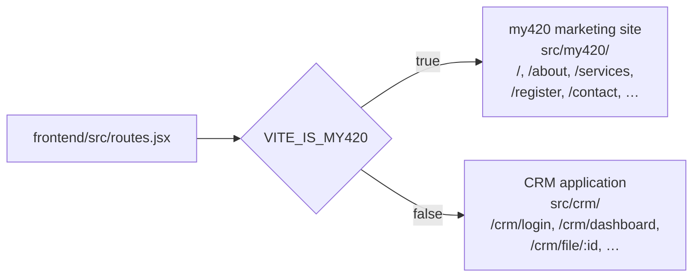

# Architecture Overview

> Part of the [architecture documentation](./README.md). See also
> [Module Diagram](./02-modules.md) and [Database Schema](./03-database.md).

## What this system is

A clinical CRM/EMR for a Hepatitis C and HIV testing and treatment program,
together with the public marketing website (my420.ca) that feeds registrations
into it.

Two distinct user-facing products are built from one repository:

- **The CRM** — an internal application for clinical staff. Patient records,
  assessments, medications, dispensing, notes, activities, interactions,
  document attachments, telehealth video sessions, and an AI analytics
  assistant.
- **The public site** — a marketing and intake website with service
  information, SEO landing pages, a contact form, and a registration form.

Both ship from the same React bundle; a build-time flag decides which one a
given deployment serves. See [Two sites, one bundle](#two-sites-one-bundle).

## Deployment topology

The widest view: this is a **multi-tenant fleet of single-tenant deployments**.

Each organisation gets its own isolated instance — its own VPS, its own domain,
its own database, its own object storage. Nothing is shared at the application
or data layer. What *is* shared are two central services: HashiCorp Vault for
secrets and certificate issuance, and a Loki/Prometheus pair for observability.

### What makes an instance a tenant

Three environment variables turn an otherwise identical stack into a specific
organisation's deployment:

| Variable | Effect |
|---|---|
| `CLIENT_ID` | Selects the tenant's secret path in Vault — `secret/data/{CLIENT_ID}`. The Vault agent renders it to `/etc/vault/secrets/.env`, which every service reads. |
| `PKI_ROLE` | Selects the PKI role Vault issues internal certificates from — `pki/issue/{PKI_ROLE}`, common name `{HOSTNAME}.internal`, 720-hour TTL. |
| `INSTANCE_NAME` | Stamped as a label on every log line and metric, so the central Grafana can filter one tenant's data out of the shared stream. |

Plus `DOMAIN_ROOT` / `DOMAIN_NAME` for the public hostname, and `IS_MY420`,
which distinguishes the original my420.ca deployment from a new tenant — it
controls both the public marketing routes and whether seeded reference data
survives installation.

### Two kinds of TLS

Worth separating, because they come from different authorities:

- **Public traffic** — Caddy obtains and renews Let's Encrypt certificates
  itself, with no certbot involved. The `caddy_data` volume persists them.
- **Internal traffic** — Vault's PKI engine issues short-lived certificates for
  service-to-service mTLS: the backend to Postgres, and the Alloy agent to the
  central Loki and Prometheus endpoints.

### Certificate and secret rotation

Rotation is push-driven rather than polled. When Vault re-renders a template,
the agent touches a trigger file; a small host daemon notices and restarts only
the affected Compose profile:

The watcher scripts are installed onto the host as systemd units by a
privileged one-shot container — see `scripts/setup-watcher.sh`,
`scripts/secret-reload.sh`, and `scripts/cert-reload.sh`.

### Replaces the old diagram

This section supersedes `assets/system_diagram.png`, which shows the same
multi-tenant shape but with **Nginx** reverse proxies. Nginx was replaced by
Caddy in commit `97201b7`, and the certbot flow it implied is gone — Caddy
handles ACME natively.

## System context

Zooming into a **single instance**: who talks to it, and what it talks to.

Note there are **four** classes of caller, not one. Three of them are not
logged-in staff, and each has its own authentication path — see
[Three parallel auth identities](./02-modules.md#three-parallel-auth-identities).

## Containers

Zooming in one more level — the runtime pieces **inside a single instance** and
how a request moves between them.

**Caddy is the only ingress.** It publishes ports 80 and 443 and nothing else
is exposed publicly — in production only the MinIO console is additionally
published, and it is bound to `127.0.0.1:9001` so it is reachable only through
an SSH tunnel.

The routing split is the important detail:

| Caddy rule | Destination | Effect |
|---|---|---|
| `handle_path /api/*` | `http://backend:8000` | **Strips the `/api` prefix.** The backend never sees it, which is why FastAPI routes are declared as `/auth/...`, not `/api/auth/...` |
| `handle /*` | `/srv/react` | Static SPA with `try_files {path} /index.html` so client-side routes resolve |

Config lives in [`prod.caddy`](../prod.caddy) and [`dev.caddy`](../dev.caddy).
The `nginx/` directory and `assets/system_diagram.png` are leftovers from the
pre-Caddy setup and no longer describe production.

## Datastore ownership

Four datastores, with sharply different roles. Getting this wrong is the most
common misreading of this codebase, so it is worth stating plainly:

| Store | What it owns | Durability | Wired up in |
|---|---|---|---|
| **Postgres 16** | **System of record.** Auth and users, patients and every clinical child record, object metadata, reference data, website form submissions. 19 application tables. | Authoritative | [`storage/postgres.py`](../backend/app/common/storage/postgres.py) |
| **MinIO** | Binary blobs only — buckets `photos` and `attachments`. Object keys are mirrored into Postgres (`patient_photos.photo_key`, `attachments.file_key`), so Postgres remains the index. | Authoritative for file bytes | [`storage/minio.py`](../backend/app/common/storage/minio.py) |
| **Redis 7** | Ephemeral state only: AI chat history (capped at 10 messages, 20-minute TTL) and Zoom session metadata hashes keyed `session:metadata:{patient_id}`. | Disposable — nothing here survives a flush | [`storage/redis.py`](../backend/app/common/storage/redis.py) |
| **MongoDB** | One collection, `legacy_data` — spreadsheet uploads for the analytics assistant, one document per user. | Re-uploadable | [`storage/mongodb.py`](../backend/app/common/storage/mongodb.py) |

MongoDB is **not** the patient database. An older project summary
(`.emergent/summary.txt`) describes it as such; that has not been true since the
Postgres migration.

All four are opened as module-level singletons during the FastAPI `lifespan`
startup in [`main.py`](../backend/app/main.py) and closed in reverse order on
shutdown.

## Request lifecycle

A typical authenticated read, end to end:

Two credentials are in play, and they live in deliberately different places:

- **Access token** — a JWT held **in memory only**, in
  [`tokenManager.js`](../frontend/src/tokenManager.js). Never written to
  `localStorage` or `sessionStorage`, so it does not survive a page reload and
  is not reachable by injected script through storage APIs. Lifetime 30 minutes.
- **Refresh token** — an **httpOnly cookie** (`secure`, `SameSite=strict`), so
  JavaScript cannot read it at all. Lifetime 7 days. Every axios request sets
  `withCredentials = true` so the cookie rides along.

On boot and on tab focus the SPA calls `POST /auth/refresh` to exchange the
cookie for a fresh access token. The axios request interceptor refreshes
proactively when the current token is within 2 minutes of expiry, using a mutex
and a queue so concurrent requests block on a single in-flight refresh rather
than stampeding.

## Two sites, one bundle

One React codebase produces two different websites, chosen at **build time**:

The backend mirrors the same flag: `IS_MY420` gates whether the `/my420` router
(the public contact and registration endpoints) is mounted at all, in
[`main.py`](../backend/app/main.py). A CRM-only deployment simply does not have
those routes.

The flag reaches even the database — the `app.legacy_instance` Postgres setting
is derived from it and decides whether seeded reference data survives a fresh
install. See
[clean-slate behaviour](./03-database.md#clean-slate-on-non-my420-deployments).

### A second flag worth knowing about

`DEBUG` mounts [`backend/app/testing/`](../backend/app/testing/), a set of test
helper endpoints that return **raw verification tokens, password-reset tokens,
and MFA codes** in plain JSON, and can create pre-verified admin users. They
exist so integration tests can run without a mail server.

**This router must never be mounted in production.** `DEBUG` also enables
uvicorn's `reload`.

## Technology summary

| Layer | Technology | Version | Entry point |
|---|---|---|---|
| Edge | Caddy | latest | [`prod.caddy`](../prod.caddy) |
| Frontend | React + Vite | 18.2 / 7.x | [`frontend/src/main.jsx`](../frontend/src/main.jsx) |
| Routing | react-router-dom | 7.7 | [`frontend/src/routes.jsx`](../frontend/src/routes.jsx) |
| Styling | Tailwind CSS | 4.x | [`frontend/tailwind.config.js`](../frontend/tailwind.config.js) |
| Frontend state | React Context (7 providers) | — | [`frontend/src/context/`](../frontend/src/context/) |
| HTTP client | axios | 1.12 | [`frontend/src/services/api.js`](../frontend/src/services/api.js) |
| Backend | FastAPI + uvicorn | 0.115 / 0.30 | [`backend/app/main.py`](../backend/app/main.py) |
| Validation | pydantic | 2.7 | `schemas.py` per module |
| Runtime | Python | 3.11 | [`backend/Dockerfile`](../backend/Dockerfile) |
| Postgres driver | asyncpg | 0.30 | no ORM — hand-written SQL |
| Object storage | aioboto3 (S3 API) | 15.1 | [`storage/minio.py`](../backend/app/common/storage/minio.py) |
| Mongo driver | motor | 3.3 | [`storage/mongodb.py`](../backend/app/common/storage/mongodb.py) |
| LLM | Anthropic SDK | 0.64 | [`analytics/rag.py`](../backend/app/core/analytics/rag.py) |
| Video | Zoom Video SDK | 2.3 | [`context/ZoomContext.jsx`](../frontend/src/context/ZoomContext.jsx) |
| Migrations | dbmate | latest | [`db/migrations/`](../db/migrations/) |

There is **no ORM**. Every query is hand-written SQL executed through asyncpg
with `$1` placeholders. This is a deliberate, consistent choice across all
modules — see [the layering convention](./02-modules.md#the-layering-convention).

## Environments

Four Compose configurations, selected by profile rather than by separate stacks:

| Environment | File | Secrets | TLS | Frontend |
|---|---|---|---|---|
| Production | [`compose.yml`](../compose.yml) | Vault agent renders `/etc/vault/secrets/.env` | Caddy ACME (public), Vault PKI (internal mTLS) | Pre-built static, served by Caddy |
| Staging | [`compose.staging.yml`](../compose.staging.yml) | Same as production | Same as production | Same as production |
| Development | [`compose.dev.yml`](../compose.dev.yml) | Repository `.env` | mkcert certs in `./certs`, Caddy on `:80` | Vite dev server, proxied |
| Test | [`compose.test.yml`](../compose.test.yml) | Hardcoded inline values | None — plain HTTP | Vite in the test container |

Staging is topologically identical to production; the difference is memory
limits, sized for a much smaller VM.

Readiness is handled imperatively rather than with Compose healthchecks —
`scripts/wait-for-db.sh` polls `pg_isready`, `scripts/wait-for-backend.sh` polls
`/health`, and dbmate's `--wait` flag blocks until Postgres accepts connections.
There are no `healthcheck:` blocks in any Compose file.

Full deployment mechanics — Vault PKI and the certificate hot-reload watchers,
the Grafana Alloy log and metric pipeline, and the GitHub Actions test and
deploy workflows — are **not** covered in this pass. See
[known gaps](./README.md#known-gaps).
