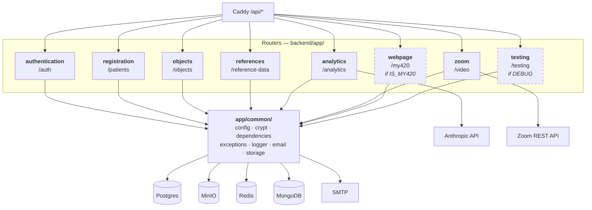
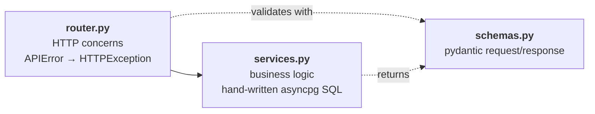
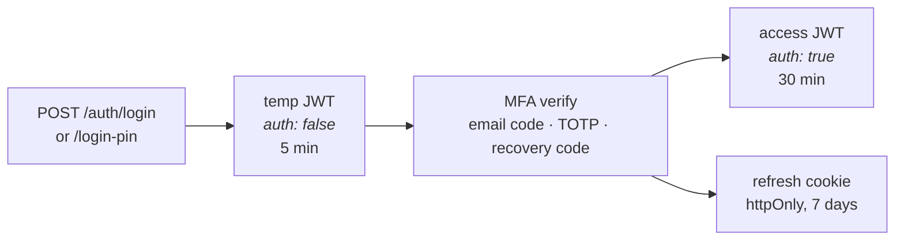
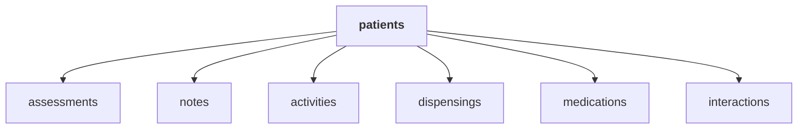
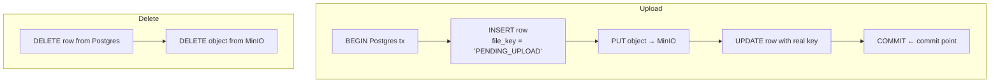
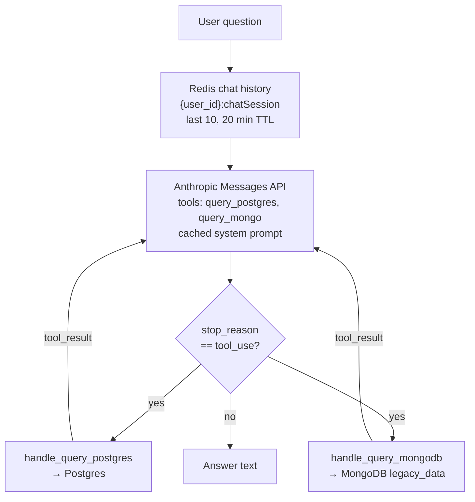
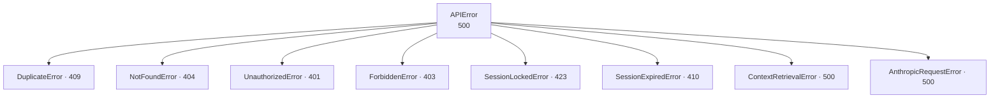
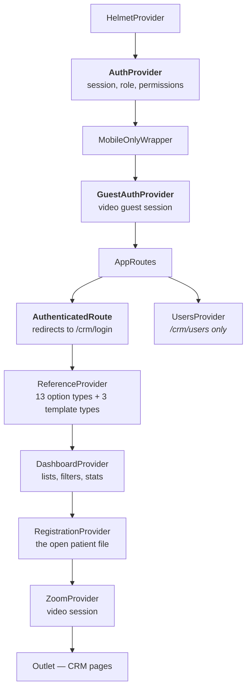
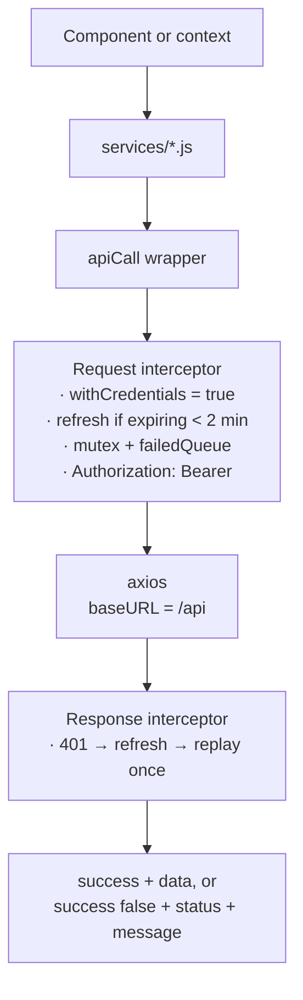

# Module Diagram

> Part of the [architecture documentation](./README.md). See also
> [Architecture Overview](./01-overview.md) and
> [Database Schema](./03-database.md).

This document maps the code: what each module owns, what it talks to, and where
the non-obvious connections are.

---

# Backend

## Module map

Eight routers are mounted in [`backend/app/main.py`](../backend/app/main.py).
Two of them are conditional.

| Module | Prefix | Path | Datastores |
|---|---|---|---|
| authentication | `/auth` | [`core/authentication/`](../backend/app/core/authentication/) | Postgres, SMTP |
| registration | `/patients` | [`core/registration/`](../backend/app/core/registration/) | Postgres, SMTP, MinIO (indirect) |
| objects | `/objects` | [`core/objects/`](../backend/app/core/objects/) | MinIO, Postgres |
| references | `/reference-data` | [`core/references/`](../backend/app/core/references/) | Postgres |
| analytics | `/analytics` | [`core/analytics/`](../backend/app/core/analytics/) | Anthropic, Postgres, MongoDB, Redis |
| zoom | `/video` | [`core/zoom/`](../backend/app/core/zoom/) | Redis, Zoom REST API |
| webpage | `/my420` | [`webpage/`](../backend/app/webpage/) | Postgres, SMTP |
| testing | `/testing` | [`testing/`](../backend/app/testing/) | Postgres, Redis |

Plus `GET /health`, declared inline in `main.py`.

Because Caddy's `handle_path /api/*` strips the prefix, a route declared as
`/auth/login` is reached from the browser at `/api/auth/login`.

## The layering convention

Every module follows the same three-file shape. Learn it once and every module
reads the same way:

- **`router.py`** — path declarations, dependency injection, and the translation
  of domain exceptions into `HTTPException`. Typically
  `except APIError as e: raise HTTPException(e.status_code, e.message)`.
- **`services.py`** / **`*_queries.py`** — the actual work. SQL is written by
  hand with `$1` positional parameters and executed through asyncpg. **There is
  no ORM anywhere in this codebase.**
- **`schemas.py`** — pydantic models for validation and serialisation.

Two modules deviate, both for good reason:

- **`objects`** splits by concern rather than by layer:
  `photo_services.py` / `photo_queries.py`, `attachment_service.py` /
  `attachment_queries.py`, and `object_queries.py` (the S3 wrapper shared by
  both).
- **`analytics`** adds `rag.py` (the agent loop), `tools.py` (tool definitions),
  `prompts.py` and `metadata.py` (system-prompt assembly).

## Module reference

### authentication — `/auth`

Users, credentials, and every path to a session.

Login is **two-phase**. `POST /auth/login` (or `/auth/login-pin`) does not return
a usable token — it returns a temporary JWT carrying the claim `auth: false`,
valid 5 minutes. Only after an MFA verification endpoint accepts that temp token
does the client receive a real access token with `auth: true` (30 minutes) plus
the httpOnly refresh cookie.

This is enforced by two separate dependencies in
[`common/dependencies.py`](../backend/app/common/dependencies.py):
`get_current_user` requires `auth == True`, while `get_user_pending_mfa`
requires it to be absent or false. A temp token therefore cannot reach an
application endpoint, and a full token cannot re-enter the MFA flow.

Routes: `/register`, `/send-verification`, `/verify-email`, `/login`,
`/login-pin`, `/forgot-password`, `/reset-password`, `/send-email-mfa-code`,
`/setup-authenticator-mfa`, `/verify-authenticator-mfa`, `/verify-email-mfa`,
`/verify-recovery-code`, `/regenerate-recovery-codes`,
`/disable-authenticator-mfa`, `/refresh`, `/logout`; plus user administration
`GET|POST /auth/users`, `DELETE|PATCH /auth/users/{id}`, and
`GET /auth/user/permissions`.

Services: `UserService`, `EmailMfaCodeService`, `RecoveryCodeService`,
`TokenService`. Tables: `users`, `refresh_tokens`, `verification_tokens`,
`email_mfa_codes`, `recovery_codes`.

### registration — `/patients`

The clinical core, and by far the largest module (router ~1,180 lines, services
~1,060).

One parent resource and six child collections, each child following an identical
CRUD quintet under `/patients/{patient_id}/…`:

Each child supports `POST /`, `GET /`, `GET /{child_id}`,
`DELETE /{child_id}`, `PATCH /{child_id}`. Patient-level routes add
`/patients/identity/verify`, `/patients/healthcard/verify`,
`DELETE /patients/by-name/{first}/{last}`, `PATCH /patients/{id}/status`, and a
cross-patient `GET /patients/activities/`.

**Authorisation is location-scoped.** List endpoints read
`user.location_permissions`: the literal value `"All"` means unrestricted, an
empty list is rejected with 401, and anything else filters results to those
sites.

**Patient age is not stored.** It is computed per query —
[`services.py:36`](../backend/app/core/registration/services.py) defines
`AGE_QUERY = "DATE_PART('year', AGE(dob))::INT AS age"`. See
[the schema notes](./03-database.md#patients) for why.

### objects — `/objects`

Files. Postgres holds the metadata, MinIO holds the bytes, and the two are kept
consistent by careful ordering rather than by a distributed transaction:

Upload writes to MinIO *inside* the Postgres transaction, so Postgres commit is
the commit point — a failed upload rolls the row back. Delete removes the
Postgres row first, so a failure leaves an orphaned object rather than a
metadata row pointing at nothing. Orphaned bytes are recoverable; dangling
metadata is not.

Buckets are `photos` (key `{patient_id}/{name}`, one per patient) and
`attachments` (key `{patient_id}/{attachment_id}/{file_name}`).

**Share links** are a separate token scheme in
[`objects/utils.py`](../backend/app/core/objects/utils.py) — its own
`generate_jwt`/`decode_jwt` signed with the access secret, carrying mime type,
file key and file name, expiring after 30 minutes. It produces a URL of the form
`{app_url}/crm/share-link?token=…`, and `GET /objects/share-link/{token}` and
`/metadata` are **unauthenticated by design**: the token is the credential.

### references — `/reference-data`

Tenant-configurable dropdown options and text templates — dispositions, referral
sites, medications, assessment types, note and clinical templates, and so on.
This is what makes the CRM configurable per deployment without code changes.

Routes: `POST|GET|DELETE|PATCH /reference-data/option[...]` and the same for
`/template`, plus `DELETE /reference-data/template/{type}/{name}`.

Services: `ReferenceOptionService`, `ReferenceTemplateService`. Tables:
`reference_options`, `reference_templates`.

### analytics — `/analytics`

A Claude-powered assistant that answers natural-language questions about the
data.

**This is tool-use text-to-query, not embedding-based RAG.** Despite the
filename `rag.py`, there is no vector store, no embedding model, and no
retriever. "Retrieval" means the model writes a SQL query or a Mongo aggregation
pipeline and the backend executes it.

The system prompt is assembled **once at startup**, in the `main.py` lifespan:
`get_database_schema()` introspects `information_schema.columns`, filters to a
curated table list, and `get_system_prompt()` builds four blocks — persona and
formatting rules, the Postgres schema with relationship and column glossaries,
the Mongo document shape, and an explicit local-date-to-UTC procedure. All four
are marked `cache_control: {"type": "ephemeral"}` for prompt caching.

Two guards worth knowing:

- **Mongo access is tenant-isolated server-side.** `handle_query_mongodb`
  prepends `{"$match": {"user_id": …}}` to whatever pipeline the model supplies,
  so a model-authored pipeline cannot read another user's upload.
- **Postgres access is guarded by a string check** —
  `query.lower().strip().startswith("select")` — and executes under the
  application's normal database role. Query failures are returned to the model
  as JSON rather than raised, so it can self-correct.

Routes: `GET|DELETE /analytics/legacy-data-summary`,
`POST /analytics/upload-legacy-data` (`.xlsx`/`.xls`/`.csv`, validated against a
required column list), `POST /analytics/claude-chat`.

### zoom — `/video`

Telehealth sessions built on the Zoom **Video SDK**, keyed by patient.

All session state lives in **Redis**, in a hash at
`session:metadata:{patient_id}` — session name, passcode, host id, lock flag,
and the host's last-seen timestamp. Nothing touches Postgres.

Liveness works by host heartbeat: the staff client calls
`POST /video/host/poll/{patient_id}` every 60 seconds, and a session whose host
has not been seen within the 180-second grace period is considered stale, then
deleted and recreated on next join. This is what stops an abandoned session from
holding a patient in a locked room indefinitely.

`POST /video/join/external/{patient_id}` is **unauthenticated** — a guest
supplies a passcode and a guest id and receives a session JWT. Routes also
include `/join/internal/{id}`, `/delete/{id}`, `/lock/{id}`, `/unlock/{id}`.

### webpage — `/my420`

Public intake for the marketing site, mounted only when `IS_MY420` is true. All
four routes are **unauthenticated**, as they must be: `POST /my420/contact`,
`POST /my420/register`, and their two `DELETE` counterparts. Submissions land in
`contact_messages` and `register_messages` and trigger a notification email to
the support address.

### testing — `/testing`

Mounted only when `DEBUG` is true. Returns raw verification tokens, reset
tokens, and MFA codes as JSON, creates pre-verified admin users, and can
back-date a Zoom host lease to force expiry.

This is a deliberate authentication bypass for the integration test suite.
**It must never be enabled in production.**

## Shared layer — `app/common/`

| File | Responsibility |
|---|---|
| [`config.py`](../backend/app/common/config.py) | All settings, read from environment at **import time**. `get_env()` raises on a missing variable, so a misconfigured deployment fails at startup rather than on first request. |
| [`crypt.py`](../backend/app/common/crypt.py) | `SecurityService` — Argon2 password hashing, JWT sign/decode, TOTP with Fernet-encrypted secrets, QR provisioning images, recovery codes, Zoom SDK JWTs, secure token generation and SHA-256 hashing. |
| [`dependencies.py`](../backend/app/common/dependencies.py) | `get_current_user` and `get_user_pending_mfa` — the two-phase login gate described above. |
| [`exceptions.py`](../backend/app/common/exceptions.py) | The `APIError` hierarchy and its status codes. |
| [`logger.py`](../backend/app/common/logger.py) | One `app` logger, rotating file handler at `/logs/app.log`, 10 MB × 5. Shipped off-box by Grafana Alloy. |
| [`email/`](../backend/app/common/email/) | Fluent `EmailService` over `smtplib`, message classes, and HTML templates. `attach()` pulls bytes straight from MinIO. Templates are rendered by `str.replace("{{KEY}}", …)`, not Jinja. |
| [`storage/`](../backend/app/common/storage/) | The four datastore singletons. |

### Exception hierarchy

The two unusual codes are Zoom-specific: **423 Locked** when a host has locked a
session against further joins, and **410 Gone** when a session's host lease has
expired.

### A note on permissions

`UserRead` carries `role`, `permissions`, `province`, and
`location_permissions`. There is **no permission-checking dependency** — each
router performs its own inline check (`user.role != "admin"`, or a
`location_permissions` test).

The `permissions` list specifically (values like `client`, `assessments`,
`medication`, `dispensing`, `notes`, `activities`, `interactions`,
`attachments`) is returned to the frontend via `GET /auth/user/permissions` and
used there to show or hide UI, but it is **not enforced server-side**. Role and
location checks are; the fine-grained permission list is not.

---

# Frontend

## Provider composition

The frontend's real structure is its context nesting, not its directory tree.
Providers determine what data exists at which point in the route tree:

The consequence worth internalising: **CRM data contexts mount only after
authentication succeeds.** No reference data, dashboard data, or patient data is
fetched for an unauthenticated visitor, because those providers are not in the
tree yet.

## Route tree

| Path | Component | Guard |
|---|---|---|
| `/crm/login` | `pages/AdminPIN.jsx` | public |
| `/crm/verify-email` | `pages/VerifyEmail.jsx` | public |
| `/crm/share-link` | `components/ShareViewer.jsx` | token in query string |
| `/crm/guest-video/:patientId` | `pages/GuestVideoAccess.jsx` | public (passcode entry) |
| `/crm/guest-preview/:patientId` | `pages/Preview.jsx` | `GuestAuthenticatedRoute` |
| `/crm/guest-session/:patientId` | `pages/GuestVideoSession.jsx` | `GuestAuthenticatedRoute` |
| `/crm/menu` | `pages/AdminMenu.jsx` | authenticated |
| `/crm/dashboard` | `pages/AdminDashboard.jsx` | `limited` \| `standard` \| `admin` |
| `/crm/file/:patientId` | `pages/AdminEdit.jsx` | `limited` \| `standard` \| `admin` |
| `/crm/preview/:patientId` | `pages/Preview.jsx` | `limited` \| `standard` \| `admin` |
| `/crm/video/:patientId` | `pages/VideoSession.jsx` | `limited` \| `standard` \| `admin` |
| `/crm/analytics` | `pages/AdminAnalytics.jsx` | `guest` \| `admin` |
| `/crm/register` | `pages/AdminRegister.jsx` | `standard` \| `admin` |
| `/crm/users` | `pages/UserManagement.jsx` | `admin` |

The public site (when `VITE_IS_MY420` is set) serves `/`, `/about`, `/services`,
`/register`, `/contact`, `/resources`, `/hepatitis-c`, `/hepatitis-c-ontario`.

## Directory reference

| Path | Contents |
|---|---|
| [`src/crm/pages/`](../frontend/src/crm/pages/) | Top-level screens — login, menu, dashboard, register, edit, user management, analytics, video, preview |
| [`src/crm/components/`](../frontend/src/crm/components/) | Feature components. `Client.jsx` (~1,380 lines) is the master patient demographic form |
| [`src/crm/tabs/`](../frontend/src/crm/tabs/) | The seven patient-file tabs: Activities, Assessments, Attachments, Dispensing, Interactions, Medication, Notes |
| [`src/crm/ui/`](../frontend/src/crm/ui/) | Presentational primitives — date pickers, pagination, password input, list items |
| [`src/crm/managers/`](../frontend/src/crm/managers/) | Inline reference-data editors surfaced from within forms |
| [`src/crm/forms/Registration.js`](../frontend/src/crm/forms/Registration.js) | `DEFAULT_FORM` — the canonical ~40-field patient shape |
| [`src/my420/`](../frontend/src/my420/) | The public marketing site: header, footer, routes, and eight pages |
| [`src/context/`](../frontend/src/context/) | The seven providers |
| [`src/services/`](../frontend/src/services/) | One module per backend domain |
| [`src/utils/`](../frontend/src/utils/) | Image compression, data formatting, document loading, Google Maps loader, speech parsing |

`Client.jsx` plus the seven `tabs/` modules are the shared core reused by **both**
`AdminRegister.jsx` (new patient) and `AdminEdit.jsx` (existing patient) — the
natural "patient file" unit.

## Context reference

| Context | Holds | Fetches |
|---|---|---|
| `AuthContext` | `isAuthenticated`, `userRole`, `userPermissions`, `userProvince`, `userLocationPermissions`, MFA state | `/auth/refresh` on mount and on tab focus, then `/auth/user/permissions` |
| `GuestAuthContext` | Guest session JWT, session name and passcode | `/video/join/external/:id` |
| `ReferenceContext` | 13 option types and 3 template types | 16 parallel fetches in one `Promise.all` on mount |
| `DashboardContext` | Pending / submitted / activity lists, ~10 filter fields, stats | `/patients`, `/patients/activities/` |
| `RegistrationContext` | The open patient file — assessments, notes, interactions, dispensing, medications, activities, attachments | Six-way fan-out per patient |
| `UserContext` | Admin user list | `/auth/users` |
| `ZoomContext` | Video SDK client, media state, participants, lock state | Zoom SDK; polls host lease every 60 s |

`ReferenceContext` filters `referral_site` options by the user's
`location_permissions`, so two staff members in different regions see different
dropdown contents from the same endpoint.

## Frontend to backend

Every request goes through one axios instance:
[`src/services/api.js`](../frontend/src/services/api.js).

The `apiCall()` envelope normalises everything, so components branch on
`result.success` rather than catching exceptions.

Two paths deliberately skip the refresh logic: any URL containing `/auth`
(refreshing during a refresh would recurse) and `GET /share-link/*` (the token
in the query string *is* the credential — there is no session to refresh).

| Service module | Backend router |
|---|---|
| `authService.js`, `userServices.js` | `/auth` |
| `patientServices.js` | `/patients` |
| `objectService.js`, `shareLinkService.js` | `/objects` |
| `referenceService.js` | `/reference-data` |
| `videoService.js` | `/video` |
| `analyticsService.js` | `/analytics` |
| `webpageService.js` | `/my420` |
| `healthService.js` | `/health` |

## Three parallel auth identities

The system has three unrelated ways to be "logged in". Conflating them is the
easiest mistake to make when changing auth code.

```mermaid
graph TB
    subgraph s1["Staff"]
        a1["Password or PIN + MFA"]
        a2["In-memory access token<br/>+ httpOnly refresh cookie"]
        a3["Role and location guards"]
        a1 --> a2 --> a3
    end

    subgraph s2["Video guest"]
        b1["Patient link + passcode"]
        b2["Session JWT<br/>sessionStorage guest id"]
        b3["Video routes only"]
        b1 --> b2 --> b3
    end

    subgraph s3["Share-link viewer"]
        c1["Tokenised URL"]
        c2["Signed JWT in query string<br/>30 min, no session"]
        c3["One document, read-only"]
        c1 --> c2 --> c3
    end
```

| | Staff | Video guest | Share-link viewer |
|---|---|---|---|
| Credential | Password/PIN + MFA | Passcode | Token in URL |
| Carrier | Bearer header + cookie | Session JWT | Query string |
| Context | `AuthContext` | `GuestAuthContext` | none |
| Lifetime | 30 min / 7 days | Session | 30 min |
| Refresh | Yes | No | No — excluded from interceptor |
| Reach | Role-gated CRM | Video routes | A single document |

## Tests

- **Backend** — stdlib `unittest` (`IsolatedAsyncioTestCase`), not pytest,
  despite pytest being installed. No `conftest.py` anywhere. Unit tests patch
  the storage singletons; integration tests import router handlers directly and
  call them against real Dockerised services.
- **Frontend** — vitest for unit, and integration tests that make real HTTP
  calls against a running backend. Playwright drives a multi-browser Zoom
  session test.
- **Runner** — Compose profiles in
  [`compose.test.yml`](../compose.test.yml): `test_backend_unit`,
  `test_frontend_unit`, `test_backend_integration`, `test_frontend_integration`,
  each with `--abort-on-container-exit`.
