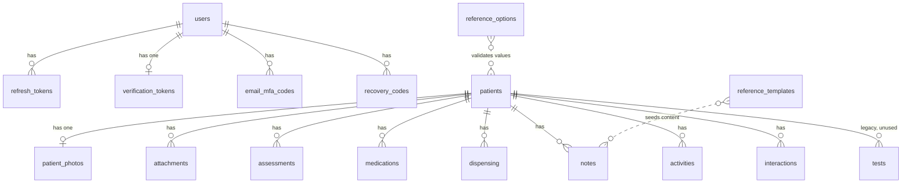
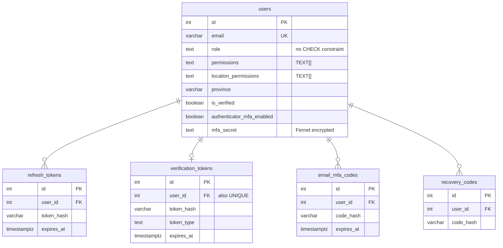
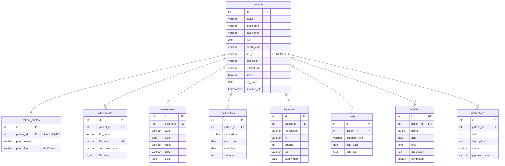
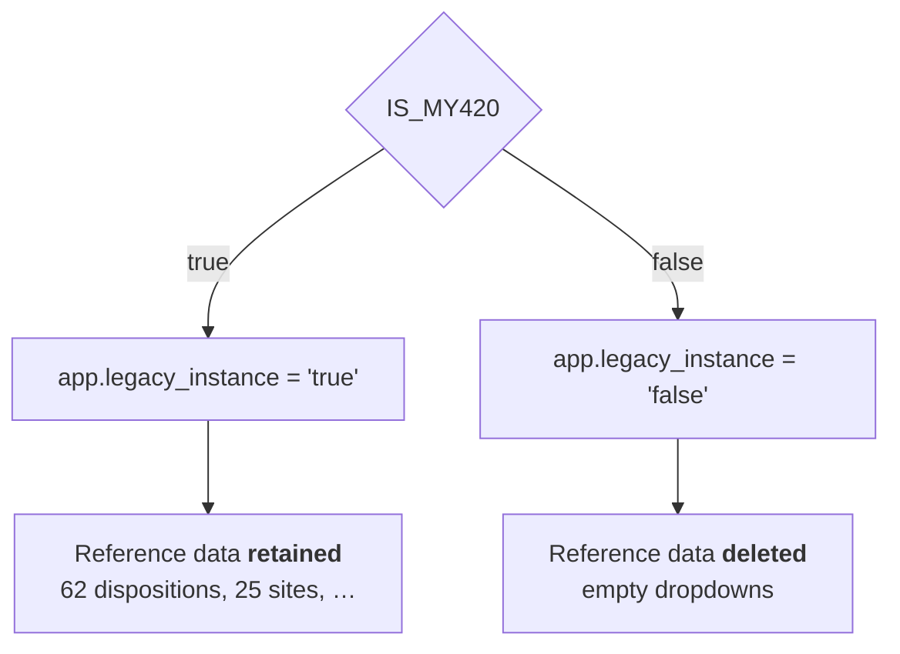
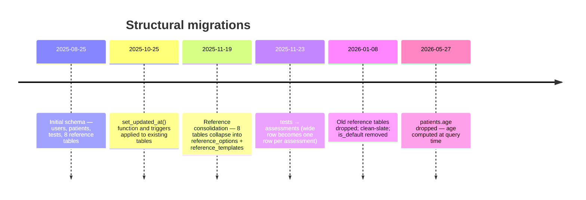

# Database Schema

> Part of the [architecture documentation](./README.md). See also
> [Architecture Overview](./01-overview.md) and
> [Module Diagram](./02-modules.md).

This describes the **current** state of the Postgres schema — the result of
applying all migrations in [`db/migrations/`](../db/migrations/) in order. Later
migrations alter and drop things the earlier ones created, so reading only the
`CREATE TABLE` statements will mislead you. Where that matters, it is called out
explicitly.

Nineteen application tables, plus dbmate's own `schema_migrations`.

## How the schema is managed

[dbmate](https://github.com/amacneil/dbmate) (`amacneil/dbmate`), run as a
Compose service in every environment with `command: ["--wait", "up"]`. The
`--wait` flag blocks until Postgres accepts connections, then applies pending
migrations and exits.

- **Files** — `db/migrations/YYYYMMDDHHMMSS_name.sql`, each with
  `-- migrate:up` and `-- migrate:down` sections.
- **State** — the `schema_migrations` table (`version` varchar primary key).
- **No committed `db/schema.sql`.** The migration files are the only definition,
  which is why this document exists.
- **No wrapper script.** dbmate is invoked purely through Compose —
  `dbmate` in production, `dbmate-dev`, `dbmate-test`.

To add a migration, create a new timestamped file in `db/migrations/` and
restart the dbmate service.

### The chain is effectively forward-only

Several `-- migrate:down` sections do not work. Some are empty, some say
"cannot reverse", and several contain outright SQL syntax errors:

| Migration | Problem with its `down` |
|---|---|
| `20250825190115_seed_document_type` | Trailing comma in the `DELETE` list |
| `20250825190122_seed_general` | `ON CONFLICT` clause inside a `DELETE` |
| `20251112181422_seed_physicians` | Same misplaced `ON CONFLICT` |
| `20251120004340_seed_dispensing_values` | Tuple literals in a single-column `IN` |
| `20260108201645_drop_old_reference_tables` | Selects 4 columns into a 5-column insert |
| `20250825190214_website` | Drops `contact_messsages` — typo, three s's |
| `20260205222858_update_attachments_unique_constraint` | Empty |
| `20260108212056_drop_is_default_from_references` | "Cannot reverse: original values are lost" |

**Plan on rolling forward, not back.** A `dbmate down` past these points will
fail or silently do the wrong thing.

One more trap: `202511121991637_update_users_role.sql` has a **13-digit**
version string (and `199163` is not a valid time). dbmate sorts version strings
lexicographically, so this file sorts *later* than its apparent timestamp
implies. It is harmless today because the ALTERs around it are independent, but
do not copy the pattern.

---

## Entity relationships

Everything hangs off two roots — `users` for identity, `patients` for clinical
data. The reference and website tables stand alone.



Note there are **no foreign keys from `patients` to `reference_options`**.
Fields such as `disposition`, `referral_site`, `coverage_type` and `physician`
are plain `VARCHAR` columns whose values are validated against reference rows in
application code, not by the database. The dotted lines above are logical
relationships, not enforced constraints.

### Auth



### Patient and clinical records



Every child table references `patients(id) ON DELETE CASCADE`. Deleting a
patient removes the entire clinical record — but **not** the underlying files in
MinIO, which are deleted separately by the application.

---

## Conventions

Before the table-by-table detail, four facts that hold across the whole schema:

1. **No PostgreSQL `ENUM` types exist.** Every enumeration is a `VARCHAR` or
   `TEXT` column, constrained either by a `CHECK` or — far more often — by
   nothing at the database level, with valid values living as rows in
   `reference_options`.
2. **Timestamps are `TIMESTAMPTZ`**, with exactly two exceptions
   (`contact_messages.created_at` and `.updated_at`, which are naive
   `TIMESTAMP`).
3. **Primary keys are `SERIAL`** integers throughout. No UUIDs.
4. **Child tables cascade** from their parent.

---

## Auth tables

### `users`

| Column | Type | Null | Default | Notes |
|---|---|---|---|---|
| `id` | SERIAL | NOT NULL | sequence | **PK** |
| `first_name` | VARCHAR(50) | NULL | | |
| `last_name` | VARCHAR(50) | NULL | | |
| `email` | VARCHAR(255) | NOT NULL | | **UNIQUE** — the login identifier |
| `phone_number` | VARCHAR(15) | NULL | | |
| `role` | TEXT | NOT NULL | `'standard'` | **No CHECK constraint** — see below |
| `permissions` | TEXT[] | NOT NULL | `'{}'` | Feature flags; **not enforced server-side** |
| `password_hash` | VARCHAR(255) | NOT NULL | | Argon2 |
| `is_verified` | BOOLEAN | NOT NULL | `FALSE` | |
| `authenticator_mfa_enabled` | BOOLEAN | NULL | `FALSE` | TOTP enrolled |
| `mfa_secret` | TEXT | NULL | | Fernet-encrypted TOTP secret |
| `created_at` | TIMESTAMPTZ | NULL | `NOW()` | |
| `updated_at` | TIMESTAMPTZ | NULL | `NOW()` | Trigger-maintained |
| `last_login` | TIMESTAMPTZ | NULL | | |
| `location_permissions` | TEXT[] | NOT NULL | `'{}'` | `{All}` means unrestricted |
| `province` | VARCHAR(100) | NULL | `'Ontario'` | |

**`role` has no CHECK constraint.** The original
`CHECK (role IN ('admin','standard','guest'))` was **dropped** in
`202511121991637_update_users_role.sql`. Roles used in code are `admin`,
`standard`, `guest`, and `limited`, but the database will accept any string —
validation is entirely in application code.

`location_permissions` and `province` were added later
(`20251127175401`); existing rows were backfilled to `{All}` and `'Ontario'`.

A separate data migration (`20251124220904`) rewrote the `permissions` array
element `'tests'` to `'assessments'` as part of the assessments rename.

### `refresh_tokens`

| Column | Type | Null | Default | Notes |
|---|---|---|---|---|
| `id` | SERIAL | NOT NULL | | **PK** |
| `user_id` | INT | NOT NULL | | **FK** → `users(id)` CASCADE. Not unique — a user may hold several |
| `token_hash` | VARCHAR(64) | NOT NULL | | SHA-256 of the token; the raw value only ever lives in the cookie |
| `expires_at` | TIMESTAMPTZ | NOT NULL | | 7 days |
| `created_at` | TIMESTAMPTZ | NULL | `NOW()` | |

### `verification_tokens`

| Column | Type | Null | Default | Notes |
|---|---|---|---|---|
| `id` | SERIAL | NOT NULL | | **PK** |
| `user_id` | INT | NOT NULL | | **FK** → `users(id)` CASCADE, **UNIQUE** — one live token per user |
| `token_hash` | VARCHAR(64) | NOT NULL | | |
| `token_type` | TEXT | NOT NULL | | `CHECK IN ('email_verification','password_reset')` |
| `expires_at` | TIMESTAMPTZ | NOT NULL | | 1 day for verification, 1 hour for reset |
| `created_at` | TIMESTAMPTZ | NULL | `NOW()` | |

The `UNIQUE` on `user_id` means requesting a new token replaces the old one —
a password reset invalidates any pending email verification and vice versa.

### `email_mfa_codes`

| Column | Type | Null | Default | Notes |
|---|---|---|---|---|
| `id` | SERIAL | NOT NULL | | **PK** |
| `user_id` | INT | NOT NULL | | **FK** → `users(id)` CASCADE |
| `code_hash` | VARCHAR(255) | NOT NULL | | 6-digit code, hashed |
| `expires_at` | TIMESTAMPTZ | NOT NULL | | 5 minutes |
| `created_at` | TIMESTAMPTZ | NULL | `NOW()` | |

### `recovery_codes`

| Column | Type | Null | Default | Notes |
|---|---|---|---|---|
| `id` | SERIAL | NOT NULL | | **PK** |
| `user_id` | INT | NOT NULL | | **FK** → `users(id)` CASCADE |
| `code_hash` | VARCHAR(255) | NOT NULL | | One row per unused code; ten issued per generation |
| `created_at` | TIMESTAMPTZ | NULL | `NOW()` | |

Indexes: `idx_recovery_codes_user_id`, `idx_recovery_codes_code_hash`.

---

## Patient core

### `patients`

The central table — 40 columns after all migrations.

| Column | Type | Null | Default | Notes |
|---|---|---|---|---|
| `id` | SERIAL | NOT NULL | | **PK** |
| `status` | VARCHAR(20) | NOT NULL | `'pending'` | `pending` → `finalized` |
| `first_name` | VARCHAR(100) | NOT NULL | | |
| `last_name` | VARCHAR(100) | NOT NULL | | |
| `dob` | DATE | NOT NULL | | Age is derived from this — see below |
| `gender` | VARCHAR(20) | NULL | | |
| `aka` | VARCHAR(100) | NULL | | Also-known-as |
| `address` | TEXT | NULL | | |
| `unit_number` | VARCHAR(20) | NULL | | |
| `city` | VARCHAR(100) | NULL | | |
| `province` | VARCHAR(100) | NULL | | No default; NULLs backfilled once to `'Ontario'` |
| `postal_code` | VARCHAR(20) | NULL | | |
| `phone1` | VARCHAR(20) | NULL | | |
| `phone2` | VARCHAR(20) | NULL | | |
| `email` | VARCHAR(150) | NULL | | |
| `language` | VARCHAR(20) | NULL | | |
| `health_card` | VARCHAR(20) | NULL | | Partial unique index — see below |
| `health_card_version` | VARCHAR(5) | NULL | | |
| `coverage_type` | VARCHAR(50) | NULL | | `OW`, `ODSP`, `No Coverage` |
| `disposition` | VARCHAR(50) | NULL | | Clinical status; 62 seeded values |
| `physician` | VARCHAR(150) | NULL | | |
| `patient_consent` | VARCHAR(50) | NULL | | verbal, written |
| `leave_message` | BOOLEAN | NULL | `false` | |
| `voicemail` | BOOLEAN | NULL | `false` | |
| `text` | BOOLEAN | NULL | `false` | |
| `preferred_time` | VARCHAR(50) | NULL | | morning, afternoon, evening |
| `rna_available` | VARCHAR(20) | NULL | | |
| `rna_result` | VARCHAR(50) | NULL | | |
| `rna_sample_date` | DATE | NULL | | |
| `referral_site` | VARCHAR(200) | NULL | | Drives location-based access control |
| `referral_person` | VARCHAR(150) | NULL | | |
| `reg_date` | DATE | NULL | `CURRENT_DATE` | |
| `special_attention` | TEXT | NULL | | |
| `instructions` | TEXT | NULL | | |
| `selected_template` | VARCHAR(200) | NULL | | |
| `summary_template` | TEXT | NULL | | |
| `finalized_at` | TIMESTAMPTZ | NULL | `NULL` | Set when status becomes `finalized` |
| `created_at` | TIMESTAMPTZ | NULL | `NOW()` | |
| `updated_at` | TIMESTAMPTZ | NULL | `NOW()` | Trigger-maintained |
| `file_id` | VARCHAR(20) | generated | — | **GENERATED ALWAYS … STORED** |
| `limited` | BOOLEAN | NOT NULL | `TRUE` | Restricted-visibility record |

**There is no `age` column.** It was dropped in
`20260527150316_update_age_column.sql`, and the replacement generated column in
that file is commented out. Age is computed at query time instead —
[`registration/services.py:36`](../backend/app/core/registration/services.py):

```sql
DATE_PART('year', AGE(dob))::INT AS age
```

This was deliberate (commit `0fcc045`): a stored age silently goes stale, a
derived one cannot.

**`file_id` is a generated column** (`20251112184333`). When `first_name`,
`last_name`, `dob` and `health_card` are all non-null it evaluates to:

```
UPPER(first_name[1]) || UPPER(last_name[1]) || LPAD(month(dob), 2, '0') || RIGHT(health_card, 2)
```

Otherwise `NULL`. It cannot be written to directly.

**Index — `unique_health_card`** is a *partial* unique index:

```sql
CREATE UNIQUE INDEX unique_health_card ON patients (health_card)
    WHERE health_card <> '0000000000';
```

Health cards must be unique, except for the sentinel `'0000000000'`, which any
number of patients may share — that is how "no health card on file" is
represented. (The source comment says `'000000'`; the actual predicate is ten
zeros.)

### `patient_photos`

| Column | Type | Null | Default | Notes |
|---|---|---|---|---|
| `id` | SERIAL | NOT NULL | | **PK** |
| `patient_id` | INTEGER | NOT NULL | | **FK** → `patients(id)` CASCADE, **UNIQUE** — one photo per patient |
| `photo_name` | VARCHAR(100) | NOT NULL | | |
| `photo_key` | VARCHAR(200) | NOT NULL | | MinIO key in the `photos` bucket, `{patient_id}/{name}` |
| `uploaded_at` | TIMESTAMPTZ | NULL | `NOW()` | No `updated_at` column |

---

## Clinical child tables

### `assessments`

The current test-and-result table, introduced in `20251123142318` to replace
`tests`.

| Column | Type | Null | Default | Notes |
|---|---|---|---|---|
| `id` | SERIAL | NOT NULL | | **PK** |
| `patient_id` | INTEGER | NOT NULL | | **FK** → `patients(id)` CASCADE |
| `type` | VARCHAR(250) | NULL | | `HIV`, `HCV`, `Bloodwork` |
| `date` | DATE | NOT NULL | `CURRENT_DATE` | |
| `result` | VARCHAR(100) | NULL | | `Positive`, `Negative`, `Pending`, `Error` |
| `tester` | VARCHAR(100) | NULL | | |
| `data` | **JSON** | NULL | | Type-specific extras. Note: `JSON`, not `JSONB` |
| `created_at` | TIMESTAMPTZ | NULL | `CURRENT_TIMESTAMP` | |
| `updated_at` | TIMESTAMPTZ | NULL | `CURRENT_TIMESTAMP` | **No trigger** — see [triggers](#functions-and-triggers) |

The migration backfilled it from `tests`: one row per non-null HCV result, one
per HIV result (with `data = {"hiv_type": …}`), one per non-null
`bloodwork_type` (with the bloodwork fields in `data`), then title-cased every
`result`.

`data` is `JSON` rather than `JSONB`, so it is stored as text — no indexing, no
containment operators, and key order and whitespace are preserved.

### `medications`

| Column | Type | Null | Default | Notes |
|---|---|---|---|---|
| `id` | SERIAL | NOT NULL | | **PK** |
| `patient_id` | INTEGER | NOT NULL | | **FK** → `patients(id)` CASCADE |
| `medication` | VARCHAR(255) | NOT NULL | | `Epclusa`, `Maviret`, `Vosevi` |
| `start_date` | DATE | NULL | | |
| `end_date` | DATE | NULL | | |
| `outcome` | TEXT | NULL | | |
| `created_at` / `updated_at` | TIMESTAMPTZ | NULL | `NOW()` | Trigger-maintained |

### `dispensing`

| Column | Type | Null | Default | Notes |
|---|---|---|---|---|
| `id` | SERIAL | NOT NULL | | **PK** |
| `patient_id` | INTEGER | NOT NULL | | **FK** → `patients(id)` CASCADE |
| `medication` | VARCHAR(255) | NOT NULL | | |
| `rx` | VARCHAR(100) | NULL | | Prescription number |
| `quantity` | INTEGER | NULL | `28` | Seeded options: 14, 28, 56, 84 |
| `lot` | VARCHAR(100) | NULL | | |
| `product_type` | VARCHAR(50) | NULL | `'Commercial'` | or `Compassionate` |
| `expiry_date` | DATE | NULL | | |
| `created_at` / `updated_at` | TIMESTAMPTZ | NULL | `NOW()` | Trigger-maintained |

### `notes`

| Column | Type | Null | Default | Notes |
|---|---|---|---|---|
| `id` | SERIAL | NOT NULL | | **PK** |
| `patient_id` | INTEGER | NOT NULL | | **FK** → `patients(id)` CASCADE |
| `template_type` | VARCHAR(50) | NOT NULL | | |
| `note_date` | DATE | NOT NULL | `CURRENT_DATE` | |
| `note_text` | TEXT | NOT NULL | | |
| `created_at` / `updated_at` | TIMESTAMPTZ | NULL | `NOW()` | Trigger-maintained |

### `activities`

| Column | Type | Null | Default | Notes |
|---|---|---|---|---|
| `id` | SERIAL | NOT NULL | | **PK** |
| `patient_id` | INTEGER | NOT NULL | | **FK** → `patients(id)` CASCADE |
| `name` | VARCHAR(50) | NOT NULL | `'General Activity'` | Added `20251120122552` |
| `date` | DATE | NOT NULL | `CURRENT_DATE` | |
| `time` | TIME | NULL | | |
| `description` | TEXT | NOT NULL | | |
| `completed` | BOOLEAN | NOT NULL | `false` | |
| `created_at` / `updated_at` | TIMESTAMPTZ | NULL | `NOW()` | Trigger-maintained |

### `interactions`

| Column | Type | Null | Default | Notes |
|---|---|---|---|---|
| `id` | SERIAL | NOT NULL | | **PK** |
| `patient_id` | INTEGER | NOT NULL | | **FK** → `patients(id)` CASCADE |
| `date` | DATE | NOT NULL | `CURRENT_DATE` | |
| `description` | TEXT | NULL | | |
| `referral_id` | VARCHAR(100) | NULL | | |
| `amount` | DECIMAL(10,2) | NULL | | The only monetary column in the schema |
| `payment_type` | VARCHAR(50) | NULL | | |
| `issued` | VARCHAR(50) | NULL | `'Select'` | |
| `created_at` / `updated_at` | TIMESTAMPTZ | NULL | `NOW()` | Trigger-maintained |

---

## Objects

### `attachments`

| Column | Type | Null | Default | Notes |
|---|---|---|---|---|
| `id` | SERIAL | NOT NULL | | **PK** |
| `patient_id` | INTEGER | NOT NULL | | **FK** → `patients(id)` CASCADE |
| `file_name` | VARCHAR(255) | NOT NULL | | Original upload name |
| `file_key` | VARCHAR(500) | NOT NULL | | **UNIQUE**. MinIO key, `{patient_id}/{attachment_id}/{file_name}` |
| `file_size` | BIGINT | NULL | | Bytes |
| `mime_type` | VARCHAR(100) | NULL | | |
| `document_type` | VARCHAR(255) | NOT NULL | | From `reference_options` type `document_type` |
| `uploaded_at` | TIMESTAMPTZ | NULL | `NOW()` | No `updated_at` column |

**The unique constraint moved** in `20260205222858`. It was
`UNIQUE (patient_id, file_name)` — which prevented a patient from ever having
two files with the same name — and is now `UNIQUE (file_key)`. Because the key
embeds the auto-generated `attachment_id`, duplicate file names are now allowed
while keys stay unique. That migration has an **empty `down`** and cannot be
reversed.

Rows are inserted with `file_key = 'PENDING_UPLOAD'` and updated with the real
key once MinIO accepts the object — see
[the upload ordering](./02-modules.md#objects--objects).

---

## Reference data

### `reference_options`

Dropdown values for the whole application.

| Column | Type | Null | Default | Notes |
|---|---|---|---|---|
| `id` | SERIAL | NOT NULL | | **PK** |
| `name` | VARCHAR(200) | NOT NULL | | The displayed value |
| `type` | VARCHAR(50) | NOT NULL | | Which dropdown this belongs to |
| `is_frequent` | BOOLEAN | NULL | `false` | Surfaced at the top of the list |
| `created_at` | TIMESTAMPTZ | NULL | `CURRENT_TIMESTAMP` | |
| `updated_at` | TIMESTAMPTZ | NULL | `CURRENT_TIMESTAMP` | **No trigger** |
| `custom_fields` | JSONB | NULL | `'{}'::jsonb` | Added `20251201172637` |

**Unique constraint:** `UNIQUE (name, type, custom_fields)`. It began as
`UNIQUE (name, type)` and was widened so the same site name can exist in more
than one province. All `referral_site` rows were set to
`custom_fields = {"province": "Ontario"}` at that time.

**`is_default` was dropped** in `20260108212056` — but not before it did
something important. See [clean slate](#clean-slate-on-non-my420-deployments).

The 13 `type` values in use: `disposition`, `referral_site`, `medication`,
`medication_outcome`, `interaction`, `coverage`, `physician`, `document_type`,
`dispensing_type`, `dispensing_quantity`, `assessment_type`,
`assessment_result`, `assessment_tester`.

### `reference_templates`

| Column | Type | Null | Default | Notes |
|---|---|---|---|---|
| `id` | SERIAL | NOT NULL | | **PK** |
| `name` | VARCHAR(200) | NOT NULL | | |
| `type` | VARCHAR(50) | NOT NULL | | `note`, `clinical`, `activity` |
| `content` | TEXT | NOT NULL | | The template body |
| `created_at` | TIMESTAMPTZ | NULL | `CURRENT_TIMESTAMP` | |
| `updated_at` | TIMESTAMPTZ | NULL | `CURRENT_TIMESTAMP` | **No trigger** |

Unique: `(name, type)`. `is_default` dropped in `20260108212056`.

---

## Website tables

Written by the public my420.ca forms. These are inbound leads, not patients —
nothing links them to `patients`; converting one into a patient record is a
manual staff action.

### `register_messages`

| Column | Type | Null | Default | Notes |
|---|---|---|---|---|
| `id` | SERIAL | NOT NULL | | **PK** |
| `first_name` | VARCHAR(255) | NOT NULL | | |
| `last_name` | VARCHAR(255) | NOT NULL | | |
| `dob` | DATE | NOT NULL | | |
| `health_card_number` | VARCHAR(50) | NULL | | **UNIQUE** — blocks duplicate public submissions |
| `phone_number` | VARCHAR(20) | NULL | | |
| `email` | VARCHAR(255) | NULL | | |
| `consent_given` | BOOLEAN | NOT NULL | `FALSE` | |
| `created_at` / `updated_at` | TIMESTAMPTZ | NULL | `NOW()` | Trigger-maintained |

### `contact_messages`

| Column | Type | Null | Default | Notes |
|---|---|---|---|---|
| `id` | SERIAL | NOT NULL | | **PK** |
| `first_name` | VARCHAR(255) | NOT NULL | | |
| `last_name` | VARCHAR(255) | NOT NULL | | |
| `email` | VARCHAR(255) | NOT NULL | | |
| `subject` | VARCHAR(255) | NULL | | |
| `message` | TEXT | NOT NULL | | |
| `created_at` | **TIMESTAMP** | NOT NULL | `NOW()` | Naive — no time zone |
| `updated_at` | **TIMESTAMP** | NOT NULL | `NOW()` | Naive — no time zone |

These two columns are the **only** naive timestamps in the schema. Everything
else is `TIMESTAMPTZ`. Worth remembering when comparing them against other
tables' timestamps.

---

## Legacy table

### `tests`

**Superseded and unused. Do not build on it.**

Replaced by `assessments` in `20251123142318`, which copied its data across. No
migration ever drops it, and no backend code references it — it simply sits
there holding a frozen copy of pre-migration history.

Columns: `id`, `patient_id` (FK CASCADE), `test_type`, `test_date`,
`hiv_result`, `hiv_type`, `hiv_tester`, `hcv_result`, `hcv_tester`,
`bloodwork_type`, `bloodwork_circles`, `bloodwork_result`,
`bloodwork_date_submitted`, `bloodwork_tester`, `created_at`, `updated_at`.

Its wide, one-row-per-patient-visit shape is exactly what `assessments` replaced
with one row per assessment.

---

## Functions and triggers

One function, defined in `20251025185938_update_function.sql`:

```sql
CREATE OR REPLACE FUNCTION set_updated_at() RETURNS TRIGGER AS $$
BEGIN
  IF (NEW.* IS DISTINCT FROM OLD.*) THEN NEW.updated_at = NOW(); END IF;
  RETURN NEW;
END; $$ LANGUAGE plpgsql;
```

The `IS DISTINCT FROM` guard means a no-op `UPDATE` does not bump `updated_at`.

The next migration, `20251025185939_apply_update_function.sql`, attached it by
**looping over every table that had an `updated_at` column at that moment**:

```sql
-- for each table in information_schema.columns where column_name = 'updated_at'
CREATE TRIGGER set_updated_at_<table> BEFORE UPDATE ON <table>
    FOR EACH ROW EXECUTE FUNCTION set_updated_at();
```

**That loop ran once and was never re-run.** Tables created afterwards therefore
have no trigger:

| Has `set_updated_at` trigger | No trigger |
|---|---|
| `users` | `assessments` — created `20251123142318` |
| `patients` | `reference_options` — created `20251119143525` |
| `tests` | `reference_templates` — created `20251119143525` |
| `notes` | |
| `interactions` | |
| `medications` | |
| `dispensing` | |
| `activities` | |
| `register_messages` | |
| `contact_messages` | |

For `assessments`, `reference_options` and `reference_templates`, `updated_at`
therefore only ever holds its insert-time default — **it does not track
updates**. Do not rely on it for change detection on those three tables, and add
a trigger explicitly if you create a new table with an `updated_at` column.

The remaining tables (`patient_photos`, `attachments`, and the four token
tables) have no `updated_at` column at all, by design — they are append-only or
replaced wholesale.

---

## Seeded reference data

Migrations seed a substantial catalogue of reference values. Counts and
representative values:

| `type` | Count | Examples |
|---|---|---|
| `disposition` | 62 | Frequent: `ACTIVE`, `BW RLTS`, `CONSULT REQ`, `DELIVERY`, `DISPENSING`, `PENDING`, `POCT NEG`, `PREVIOUSLY TX`, `SELF CURED`, `SOT`. Also `CURED`, `DECEASED`, `HIV PATIENT`, `INACTIVE`, `TX PENDING`, `UNABLE TO TX`, nine `SOT-*` variants |
| `referral_site` | 25 | Frequent: `Toronto - Outreach`, `Hamilton - Wellington`, `London - LMP`, `Ottawa - Outreach`, `Windsor - Outreach`. Plus Barrie, Brantford, Kingston, Niagara, Orillia |
| `interaction` | 22 | `Screening`, `Adherence`, `Bloodwork`, `Referral`, `Consultation`, `Outreach`, `Results`, `Safe Supply`, `Counselling`, `Housing`, `SOT`, `EOT`, `SVR` |
| `medication_outcome` | 7 | `Active`, `Completed`, `Non Compliance`, `Side Effect`, `Tx Pending`, `Did not start`, `Death` |
| `dispensing_quantity` | 4 | `14`, `28`, `56`, `84` |
| `assessment_result` | 4 | `Positive`, `Negative`, `Pending`, `Error` |
| `medication` | 3 | `Epclusa`, `Maviret`, `Vosevi` |
| `coverage` | 3 | `OW`, `ODSP`, `No Coverage` |
| `document_type` | 3 | `Consultation Report`, `Treatment Consent`, `HCV Perscription` *(sic)* |
| `assessment_type` | 3 | `HIV`, `HCV`, `Bloodwork` |
| `assessment_tester` | 2 | `JY`, `CM` |
| `dispensing_type` | 2 | `Commercial`, `Compassionate` |
| `physician` | 1 | `Dr. David Fletcher` |

`reference_templates` seeds: type `note` → `Consultation`, `Lab`,
`Prescription` (empty content); type `clinical` → `Positive` (a long
pre-written POCT narrative), `Negative - Pipes`, `Negative - Pipes/Straws`,
`Negative - Pipes/Straws/Needles`.

Admin users are **not** seeded by migration — `db/migrations/*_seed_admin.sql`
is gitignored. Admins are created at container start by
[`backend/scripts/create_admin.py`](../backend/scripts/create_admin.py) from the
`ADMIN_EMAIL` / `ADMIN_PASSWORD` / `ADMIN_PHONE` environment variables.

### Clean slate on non-my420 deployments

This is the highest-surprise behaviour in the schema, and it is intentional.

`20260108202744_clean_slate_if_not_my420.sql`:

```sql
DO $$
BEGIN
  IF current_setting('app.legacy_instance', true) = 'false' THEN
    DELETE FROM reference_options   WHERE is_default = True;
    DELETE FROM reference_templates WHERE is_default = True;
  END IF;
END $$;
```

Every seeded row in the table above was inserted with `is_default = TRUE`.
Therefore:



**A fresh non-my420 deployment starts with completely empty reference tables.**
Empty dropdowns in a new tenant are by design, not a bug — the seed data is
my420-specific clinical vocabulary, and a new organisation configures its own
through the `/reference-data` endpoints.

The setting is passed to Postgres as `-c app.legacy_instance=${IS_MY420:-false}`
by [`scripts/postgres-start.sh`](../scripts/postgres-start.sh) in
production and by the inline `command:` in `compose.dev.yml`. Note the default
is **`false`** — an unset `IS_MY420` wipes the seed data.

`is_default` was dropped one migration later, so this can never run again.

---

## Schema history

Four migrations changed the shape of the schema rather than adding to it. Each
explains something that otherwise looks odd:



1. **Reference consolidation** (`20251119143525` → `20260108201645`). Eight
   per-type tables — `note_templates`, `clinical_templates`, `dispositions`,
   `document_types`, `referral_sites`, `medication_templates`,
   `medication_outcomes`, `general` — were copied into two generic tables
   discriminated by a `type` column, then dropped seven weeks later. This is why
   `reference_options` looks so generic.
2. **tests → assessments** (`20251123142318`). A wide row with separate HIV,
   HCV, and bloodwork column groups became one row per assessment with a `type`
   discriminator and a `data` JSON column. `tests` remains as a dead table.
3. **Age derivation** (`20260527150316`). Discussed under
   [`patients`](#patients).
4. **`is_default` removal** (`20260108212056`), immediately after the
   clean-slate migration consumed it.
